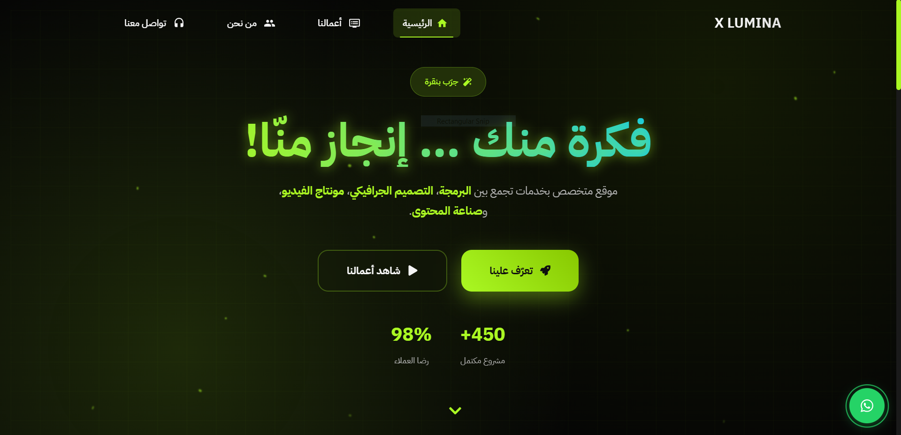
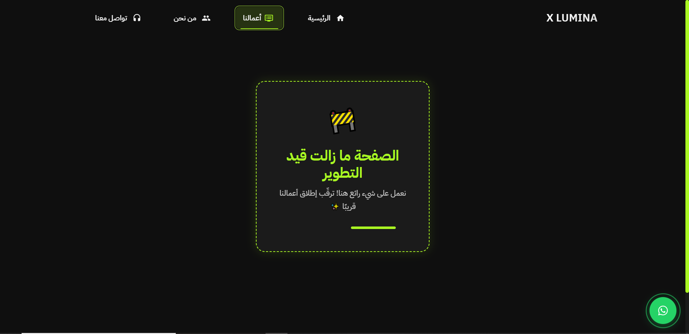
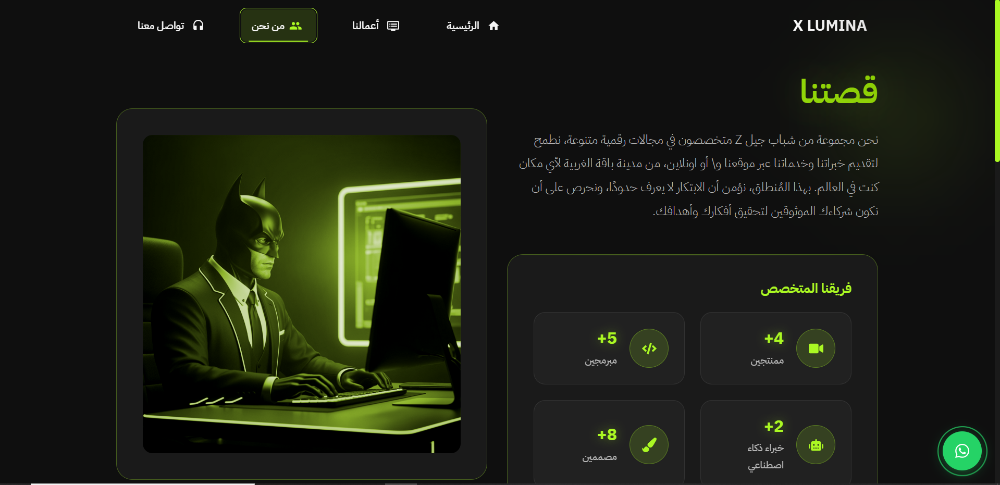
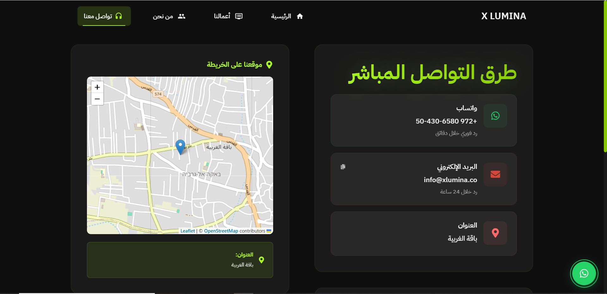

# X Lumina | Web Application

X Lumina is a sleek, interactive web app built with **React**, **CSS**, and **Framer Motion**.  
It showcases digital services like design, video editing, 3D, and web development through a smooth, responsive interface.

Delivered as a **startup project** — fully designed and developed by me, sold for **$1,500**.  
**Note:** One page is currently under development (coming soon).
Live: [https://www.xlumina.co/](https://www.xlumina.co/)

---

## Preview

---

